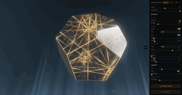

# hypercube

Single-file Three.js scene — SDF raymarched Platonic solids, a Jos-Stam mouse-driven fluid, ribbon aurora, and GPGPU particles, all running from one HTML file with no build step. Tilt a phone to control the fluid via the gyroscope.

## Live demo

https://outhead.github.io/hypercube/

## Preview

<video src="./assets/preview.mp4" poster="./assets/preview.jpg" autoplay loop muted playsinline width="720"></video>

<!-- Fallback (GitHub-flavored): if the video above doesn't play, see the GIF below. -->



Poster: [`assets/preview.jpg`](./assets/preview.jpg) · MP4 (720p): [`assets/preview.mp4`](./assets/preview.mp4)

## Run locally

```bash
git clone https://github.com/outhead/hypercube.git
cd hypercube
python3 -m http.server 8000
# open http://localhost:8000
```

Any static server works. There's no build step, no bundler, and no npm install — `index.html` pulls Three.js from a CDN and you're good.

## What's inside

Everything lives in `index.html`. The interesting landmarks:

- `SHAPE_META` — per-shape material and geometry knobs. Add an entry here to define a new shape.
- The SDF raymarching fragment shader — the glass/metal surface you see is a signed-distance-field march, lit with IBL and refracted through a thickness volume.
- The Jos-Stam fluid sim — a 256² velocity/pressure field advected and splatted by the mouse, used to distort the scene.
- The aurora ribbon shader — a `TubeGeometry` driven by a 3-frequency simplex-noise field for those drifting light sheets.
- The `GPUComputationRenderer` block — GPGPU particles whose positions and velocities are updated on the GPU each frame.

Inside the app itself, open **Export → Overview** for a live file map with current line numbers — it stays in sync as the file evolves.

## Shapes

Despite the name, it's not only a cube. The scene ships six SDF solids, all rendered as a single raymarched fragment — no vertex geometry, just distance fields and their gradients:

- **Icosahedron** — the default. 20 triangular faces, a dihedral angle of ~138.19°, `IOR ≈ 1.07`.
- **Cube** — the classic. 6 faces, sharp right-angle edges with rounded corners (`defaultRound: 0.02`).
- **Octahedron** — the dual of the cube. 8 triangular faces, tight glow (`envIntensity: 13.4`).
- **Dodecahedron** — 12 pentagonal faces, the richest surface. Uses the 6-axis pentagonal face-normal lattice for its grid.
- **Stellated** — a stellated octahedron (compound of two tetrahedra). 8 spikes, CSG-ish SDF: `icosahedron ∩ negative-dodecahedron` for the edge detection.
- **Compound** — three perpendicular boxes punched together, edges flare at the triple intersections.

Each entry in `SHAPE_META` controls its own material (IOR, glow, Fresnel power, bloom gain, scale, default zoom normal). Change shape live from the **Shape** panel, or export the current one via **Export → Overview**.

## Make it yours

- Tweak an entry in `SHAPE_META` to change geometry, material, roughness, IOR, thickness, or emissive tint.
- Switch aurora modes in the **Effects** panel — ribbons, sheets, and blended variants.
- Drag the **Mouse** sliders (Intensity, Refraction, Diffraction) to change how strongly the cursor pushes the fluid and how much chromatic spread you get.
- Change the particle count in **Effects → Particles** and watch the GPGPU sim scale.
- Use the **Export** panel to dump the current scene config or grab a shader snippet.

## Mobile

On phones and tablets, the scene reads `DeviceOrientationEvent` and dispatches synthetic mouse events — tilt the device and the fluid, cursor light, and parallax spring all respond. On iOS 13+ you'll see an **Enable tilt** button the first time: Apple requires a user gesture before granting gyroscope access. Once granted, the page remembers for the session.

## Contributing

Issues and PRs welcome. This is a playground — fork it, rip things out, build your own scene, and share it back. If something is confusing, open an issue; the README and in-app Overview should be readable before you touch the shader code.

## Further reading

- Three.js docs: https://threejs.org/docs/
- Inigo Quilez — SDF articles: https://iquilezles.org/articles/distfunctions/
- Shadertoy: https://www.shadertoy.com/
- Jos Stam — Real-Time Fluid Dynamics for Games (PDF): https://www.dgp.toronto.edu/public_user/stam/reality/Research/pdf/GDC03.pdf

## License

MIT — see [LICENSE](./LICENSE).
